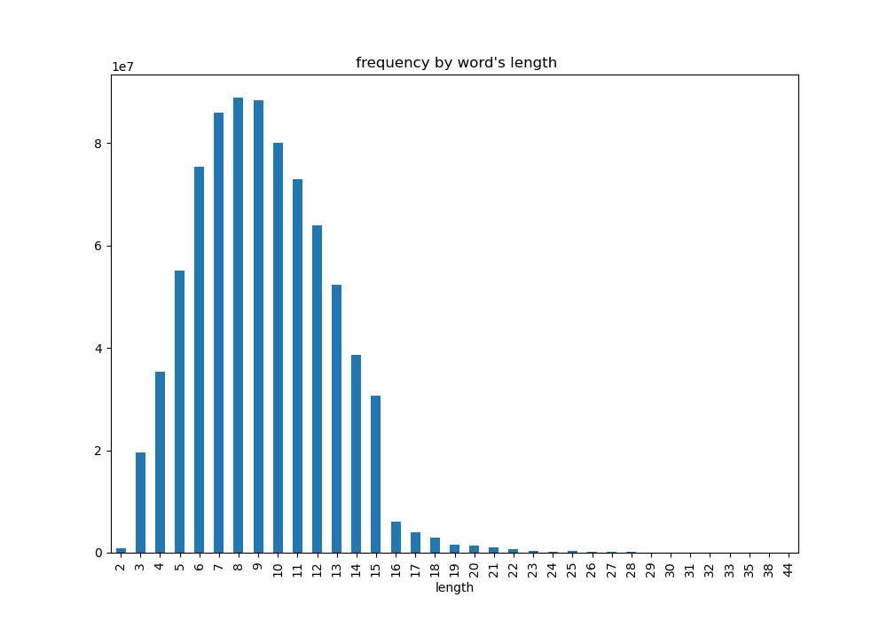
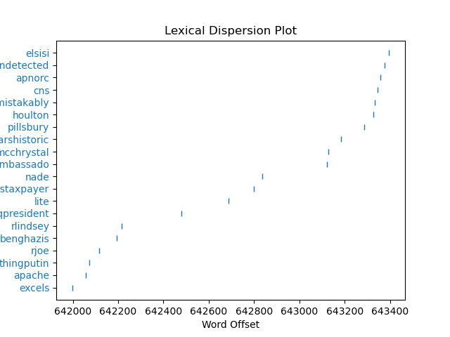
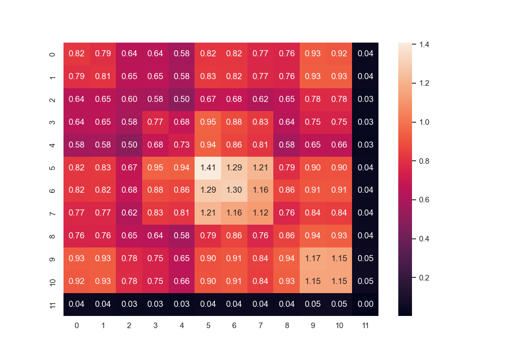
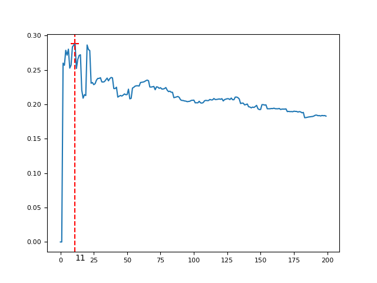
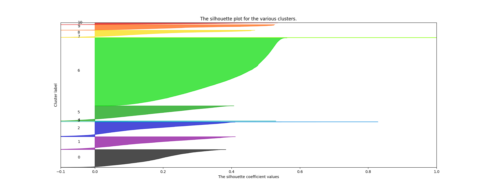
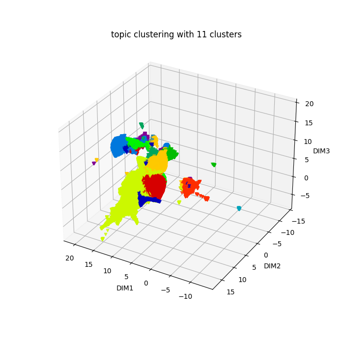

# Tâche 1 Constitution, indexation et exploration du corpus 
Pour le temps de calcule, Nous avons dévisé cette tâche en 4 sous tâches (**notebook**): 
  - <code>Clean_Lemmatization.ipynb</code> pour le nettoyage du corpus des tweets de **Donald Trump**
  - <code>TF_IDF.ipynb</code> pour l'indexation et l'extraction du vocabulaire du corpus, ainsi que le calcule des fréquences des mots . 
  - <code>RSV.ipynb</code> Pour le calcule de similitude  avec le méthode **RSV** (Real-valued syntactic)
  - <code>ideal_cluster_number.ipynb</code> utilisation du Kmean et silhouette score pour le clustering des tweets .

## [Nettoyage du corpus et lemmatization](./Clean_Lemmatization.ipynb)
---
 - **Pour le [nettoyage du corpus](./content/clean_tweet.csv)** : consiste à la suppression des emojis, uniformisation de la casse, supprimer les caractères spéciaux, segmentation, suppression de duplicata, ainsi que les **stop word**.

```python
def removeSpeCara(s:str):
    return re.sub(r"[^a-zA-Z]", "", s) 

#retirer les url
def remove_url(s:str)->str:
    url_pattern = re.compile(r"http?://\S+|https?://\S+|www\.\S+|//S+")
    return url_pattern.sub("r", s)

#retirer les html 
def remove_html(s:str)->str:
    html_pattern = re.compile(r"<.*?>")
    return html_pattern.sub("r", s)

# retirer les emojies
def remove_emoji(s:str)->str:
    emoji_pattern = re.compile("["
        u"\U0001F600-\U0001F64F"
        u"\U0001F300-\U0001F5FF" 
        u"\U0001F680-\U0001F6FF"  
        u"\U0001F1E0-\U0001F1FF"  
        u"\U00002500-\U00002BEF"  
        u"\U00002702-\U000027B0"
        u"\U00002702-\U000027B0"
        u"\U000024C2-\U0001F251"
        u"\U0001f926-\U0001f937"
        u"\U00010000-\U0010ffff"
        u"\u2640-\u2642" 
        u"\u2600-\u2B55"
        u"\u200d"
        u"\u23cf"
        u"\u23e9"
        u"\u231a"
        u"\ufe0f"
        u"\u3030"
                      "]+", re.UNICODE)
    return emoji_pattern.sub("r", s)

def clean_and_lemmatize_string(s:str):
    l = []
    s_ = " ".join([remove_html(remove_url(word)) for word in s.split()])
    for word in word_tokenize(s_):
        word_ = removeSpeCara((remove_emoji(word)))
        if not word_ in stop_words:
            if len(word_) > 2:
                l.append(word_.lower())
    tag_map = defaultdict(lambda : wn.NOUN)
    tag_map['J'] = wn.ADJ
    tag_map['V'] = wn.VERB
    tag_map['R'] = wn.ADV
    lemma_function = WordNetLemmatizer()
    return " ".join([lemma_function.lemmatize(token, tag_map[tag[0]]) for token, tag in pos_tag(l)])
```
Pour le lemmatization
``` python
  def clean_and_lemmatize_string(s:str):
      l = []
      s_ = " ".join([remove_html(remove_url(word)) for word in s.split()])
      for word in word_tokenize(s_):
          word_ = removeSpeCara((remove_emoji(word)))
          if not word_ in stop_words:
              if len(word_) > 2:
                  l.append(word_.lower())
      tag_map = defaultdict(lambda : wn.NOUN)
      tag_map['J'] = wn.ADJ
      tag_map['V'] = wn.VERB
      tag_map['R'] = wn.ADV
      lemma_function = WordNetLemmatizer()
      return " ".join([lemma_function.lemmatize(token, tag_map[tag[0]]) for token, tag in pos_tag(l)])
```
La lemmatisation tient compte du contexte et de la partie du discours (POS) du mot pour déterminer la forme de base appropriée. Elle nécessite une compréhension approfondie de la langue et repose sur des règles linguistiques et des bases de données lexicales (comme WordNet) pour effectuer la transformation de manière précise. 

##  [L'indexation et l'extraction du vocabulaire du corpus, ainsi que le calcule des fréquences des mots](./TF_IDF.ipynb) . 
---

Dans cette partie on a indexé le corpus en utilisant le méthode TF-IDF avec <code>sklearn.feature_extraction.text.TfidfVectorizer</code>
```python
  from sklearn.feature_extraction.text import TfidfVectorizer
  vectorizer = TfidfVectorizer(max_df = 0.5, use_idf = True,  dtype=np.float32)
  vectors = vectorizer.fit_transform(dataframe["text"] )
```
La classe TfidfVectorizer permet aussi de extraire le vocabulaire du corpus avec la méthode :<code>vectorizer.get_feature_names_out()</code>, dans le corpus il a 40195 mots, et pour la fréquence on utiliser <code>keras.preprocessing.text.Tokenizer</code> pour calculer la .[fréquences](./content/word_freq.csv). On a aussi essayé du calculer le fréqucence des mots selon leur longueurs , ainsi que la dispersion des 20 mots les plus fréquents dans un corpus
```python
  text = nltk.Text(nltk.word_tokenize(" ".join(dataframe["text"].tolist())))
  text.dispersion_plot(voc["vocabulary"].iloc[:20].tolist())
  plt.savefig(os.path.join("content", "Lexical_Dispersion.png"))
  plt.show()
```
.

## [Calcule de similitude  avec le méthode **RSV** (Real-valued syntactic)](./RSV.ipynb)
---

Le but de cette partie est de calculer le matrice RSV en calculant le similitude entre les mots avec l'index TF-IDF en utilisant le produit cosinus. 
<div>
    
    <p>Nous avons opté pour l'utilisation du module CuPy afin de profiter de la puissance de calcul offerte par les GPU. En effet, avec le module NumPy, les        calculs prennent beaucoup de temps.</p>
</div>

le code suivant est pour le calcule de similitude entre les mots avec CuPy

```python
    def SIM_GPU(T1, T2):
        sim = cp.dot(T1, T2.T)
        return sim

    def SIM2_GPU(T1, T2):
        return cp.sqrt(cp.power(T1,2).sum(axis=1).reshape(T1.shape[0], 1))*cp.sqrt(cp.power(T2,2).sum(axis=1).reshape(T2.shape[0], 1).T)

    def SIM(tf_idf_matrix, d=2, dtype=np.float16):
        m = tf_idf_matrix.shape[0]//d
        mm = tf_idf_matrix.shape[0]%d
        sim = np.zeros((tf_idf_matrix.shape[0], tf_idf_matrix.shape[0]), dtype=dtype)
        print("Allocation success")
        for i in tqdm(range(d)):
            for j in range(d):
                with cp.cuda.Device(0):
                    T1 = cp.asarray(tf_idf_matrix[i*m:(i+1)*m+(i+1==d)*mm, 0:tf_idf_matrix.shape[1]], dtype=cp.float32)
                    T2 = cp.asarray(tf_idf_matrix[j*m:(j+1)*m+(j+1==d)*mm, 0:tf_idf_matrix.shape[1]], dtype=cp.float32)
                    sim[i*m:(i+1)*m+(i+1==d)*mm, j*m:(j+1)*m+(j+1==d)*mm] = np.nan_to_num(cp.asnumpy(SIM_GPU(T1, T2)/SIM2_GPU(T1, T2)))
                    mempool.free_all_blocks()
                    pinned_mempool.free_all_blocks()
        return sim
```
```python
  sim = SIM(np.asarray(vectors.todense().T, dtype=np.float16).T, d=10)
```
Afin de gérer les contraintes de mémoire, nous avons choisi d'utiliser <code>float16</code> ainsi que de réaliser les calculs sur chaque bloc de la matrice TF-IDF. *Dans notre example on utiliser 10 bloques*
Après les calculs, nous avons réduit la matrice en supprimant les lignes (ou colonnes) qui ne contenaient aucun mot similaire.
*Cette matrice on aura besoin dans la tâche 4 Barre de recherche*

Pour trouver les mots les plus similaires, On applique une convolution sur la matrice de similitude avec un filtre de 1 de taille (5000, 5000) avec un strides de (5000, 5000), puis avec la matrice de <code>sn.heatmap</code> , on cherche le bloc ayant la plus grand valeur, representant le bloc de la matrice **RSV** qui contient les mots les plus similaires.

```python
  strides = (5000, 5000)
  def cal_conv(A, strides):
      res1 = A.shape[0]%strides[0]
      res2 = A.shape[1]%strides[1]
      output_shape = int((A.shape[0] - res1)/strides[0] + (res1!=0)) , int((A.shape[1] - res2)/strides[1] + (res2!=0))
      output = cp.zeros(output_shape, dtype=cp.float32)

      for i in tqdm(range(output_shape[0])):
          for j in range(output_shape[1]):
              output[i, j] = cp.asarray(A[i*strides[0]: (i+1)*strides[0]+(i==output_shape[0]-1)*res1,
                                          j*strides[1]: (j+1)*strides[1]+(j==output_shape[1]-1)*res2], dtype=cp.float32).sum()
      return cp.asnumpy(output*100)/A.sum()
```
comme resultat on a:

[Les mots qui affichent la plus grande similarité](./content/The_most_similar_words_in_the_corpus.csv) se situent dans l'intervalle de 25 000 à 30 000: 

## [Utilisation de la méthode Kmean et silhouette score pour le clustering des tweets](./ideal_cluster_number.ipynb)
---

Nous avons utilisé l'algorithme K-means et le score de silhouette pour effectuer le regroupement (clustering) des tweets en utilisant l'index TF-IDF.
Afin de déterminer le nombre optimal de clusters, nous avons utilisé le score de silhouette en effectuant une itération sur un intervalle de 3 à 200. En sélectionnant le nombre de clusters correspondant au score de silhouette le plus élevé, nous avons identifié le nombre idéal de clusters dans cet intervalle.


- **SVD (Single Vector Decomposition)**
Avant de rechercher le nombre optimal de clusters, nous avons prétraité les données en réduisant les dimensions à l'aide de la méthode **SVD (Single Vector Decomposition)**. Avec l'index brut, un problème se pose "chevauchement des clusters", même avec un grand nombre de clusters, car il y a de nombreux zéros. 

```python
  U, Sigma, VT = randomized_svd(vectors, n_components=10, n_iter=100,random_state=122)
```
- **Trouver le nombre de cluster idéal avec K-mean et silhouette score**
```python 
  from sklearn.metrics import silhouette_score, silhouette_samples
```
```python
  def cal_ideal_clusters_number(data, minK=2, maxK = 60, step=10):
    silhouette_score_k = []
    labels_ = []
    for k in tqdm(range(minK, maxK+1, step)):
        model = KMeans(n_clusters=k, n_init="auto", random_state=10)
        model.fit(data)
        silhouette_score_k.append(silhouette_score(data, model.labels_))
        print(f"for k {k} ==> {silhouette_score_k[-1]}")
    return silhouette_score_k
```
```python
  K_init = 3
  K_final = 200
  step = 1
  X = U*Sigma
  silhouette_score_k = cal_ideal_clusters_number(X, minK=K_init, maxK=K_final, step=step)
```

comme resultat pour l'interval [3,200] le numbre de cluster optimal est 11 avec un score de :0.2877790864291461.

- **Silhouette Sample**
  Avec <code>sklearn.metrics.silhouette_samples</code> on a utilisé pour visualisé le regroupement (clustering) des tweets.
  
```python
y_lower = 10
fig, ax1 = plt.subplots()
fig.set_size_inches(18, 7)
ax1.set_xlim([-0.1, 1])
ax1.set_ylim([0, len(X) + (n_clusters + 1) * 10])
for i in range(n_clusters):
    ith_cluster_silhouette_values = sample_silhouette_values[cluster_labels == i]
    ith_cluster_silhouette_values.sort()
    size_cluster_i = ith_cluster_silhouette_values.shape[0]
    y_upper = y_lower + size_cluster_i
    color = cm.nipy_spectral(float(i) / n_clusters)
    ax1.fill_betweenx(
        np.arange(y_lower, y_upper),
        0,
        ith_cluster_silhouette_values,
        facecolor=color,
        edgecolor=color,
        alpha=0.7,
    )
    ax1.text(-0.05, y_lower + 0.5 * size_cluster_i, str(i))
    y_lower = y_upper + 10 
ax1.set_title("The silhouette plot for the various clusters.")
ax1.set_xlabel("The silhouette coefficient values")
ax1.set_ylabel("Cluster label")
ax1.set_yticks([]) 
ax1.set_xticks([-0.1, 0, 0.2, 0.4, 0.6, 0.8, 1])
plt.show()
  ```


-**UMAP**
Pour visualiser le clustering en 3D nous avons utiliser UMAP, PCA et t-SNE nous donnest des "chevauchement des clusters", 
```python
  embedding = UMAP(n_components=3, n_neighbors=100, min_dist=0.5, random_state=12, n_jobs=-1).fit_transform(X)
```


