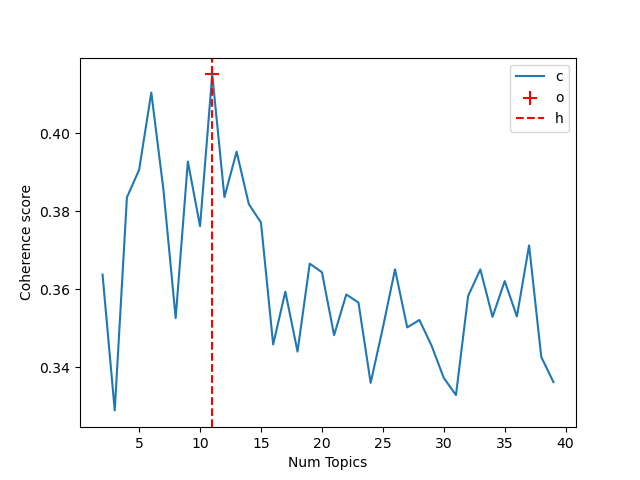
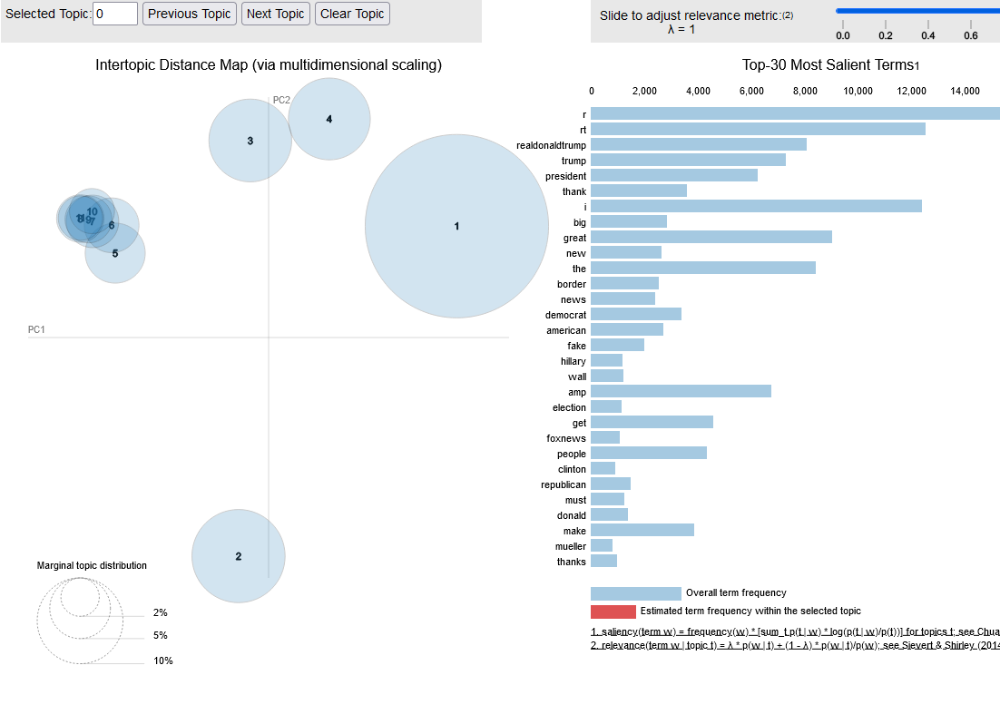
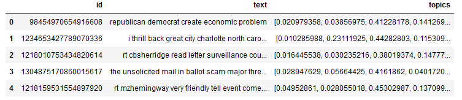

# Tâche 2 Analyse thématique du corpus 
Dans cette partie, afin d'extraire les thèmes du corpus, nous avons utilisé un modèle non supervisé: 
 - **LDA(Latent Dirichlet Allocation)** :  est une méthode de modélisation de sujets largement utilisée dans le domaine du traitement automatique du langage naturel. L'objectif principal de LDA est de découvrir les thémes sous-jacents dans un ensemble de documents en supposant que chaque document est une combinaison de plusieurs sujets et que chaque mot dans le document est attribué à un de ces sujets.
 
# [LDA(Latent Dirichlet Allocation)](./LDA.ipynb)

Le package <code>gensim</code> offre une implémentation de l'algorithme LDA avec <code>gensim.models.ldamodel.LdaModel</code>  

```python
 model = LdaModel(corpus=corpus, num_topics=num_topics, id2word=id2word,alpha="auto", random_state=100, update_every=1,chunksize=100,passes=10)
```
Avant d'utilisé l'algorithme, nous avons calucule la fréquence des terms des tweets:

```python
# Tokenize the tweets using NLTK
tokenizer = nltk.tokenize.TweetTokenizer()
tweets = [tokenizer.tokenize(tweet) for tweet in tweets_df['text'].tolist()]
id2word = Dictionary(tweets)
# Term Document Frequency
corpus = [id2word.doc2bow(text) for text in tweets]
```

Pour trouvé le nombre idéal des thèmes, nous utiliserons la valeur de coherence utilisé pour evalué un model **LDA**, pour cela nous avons effectué une itération sur le nombre de thèmes dans la plage de 2 à 40. Ensuite, nous avons sélectionné le modèle qui présentait la cohérence la plus élevée. Ce modèle est considéré comme étant le modèle optimal.

```python

def compute_coherence_values(dictionary, corpus, texts, limit, start=2, step=3):
    """
    Compute c_v coherence for various number of topics

    Parameters:
    ----------
    dictionary : Gensim dictionary
    corpus : Gensim corpus
    texts : List of input texts
    limit : Max num of topics

    Returns:
    -------
    model_list : List of LDA topic models
    coherence_values : Coherence values corresponding to the LDA model with respective number of topics
    """
    coherence_values = []
    model_list = []
    for num_topics in tqdm(range(start, limit, step)):
        model = LdaModel(corpus=corpus, num_topics=num_topics, id2word=id2word,alpha="auto", random_state=100, update_every=1,chunksize=100,passes=10)
        model_list.append(model)
        coherencemodel = CoherenceModel(model=model, texts=texts, dictionary=dictionary, coherence='c_v')
        coherence_values.append(coherencemodel.get_coherence())

    return model_list, coherence_values
```

```python
limit=40; start=2; step=1;
model_list, coherence_values = compute_coherence_values(dictionary=id2word, corpus=corpus, texts=tweets, start=start, limit=limit, step=step)
```
Après l'itération, nous avons obtenu le graphe suivant, où il est notable que le meilleur score de cohérence de **0.41501177695990976**  obtenu avec 11 thèmes.



Pour afficher la cartographie thématique nous avons utilisé le module <code>pyLDAvis</code>. [version html](./content/cartographie_thematique.html) .

```python
#Creating Topic Distance Visualization 
pyLDAvis.enable_notebook()
p = pyLDAvis.gensim.prepare(optimal_model, corpus, id2word)
pyLDAvis.save_html(p, os.path.join("content","cartographie thématique.html"))
p
```



Cette approche de modélisation sera bénéfique pour annoter le corpus en associant les thèmes correspondants, cette annotation nous sera utile pour la tâche 4 du projet. Le code suivant pour effectuer cette annotation sur le corpus.

```python
tweets_df['topics'] = [[top[1] for top in tops] for tops in optimal_model.get_document_topics(corpus, minimum_probability=0)]
```



