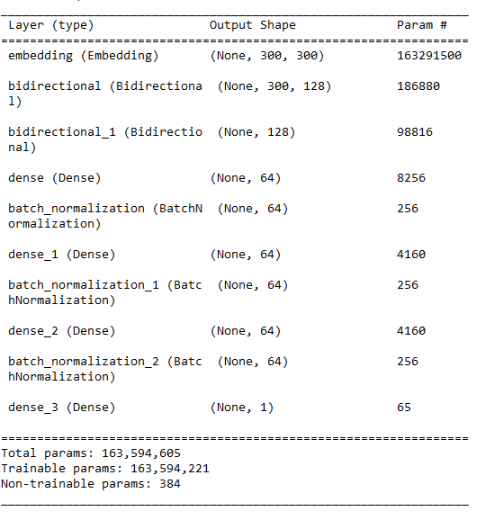
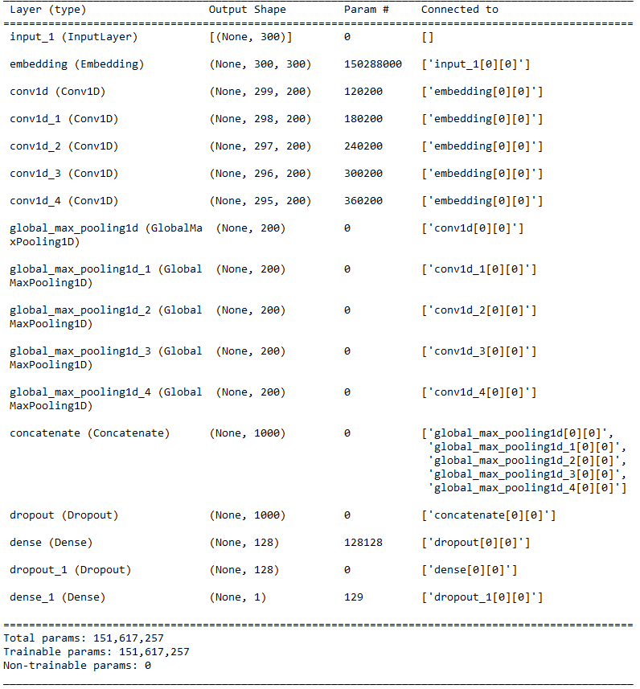
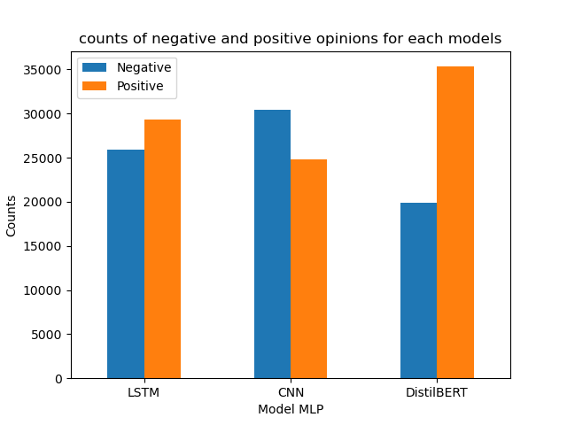
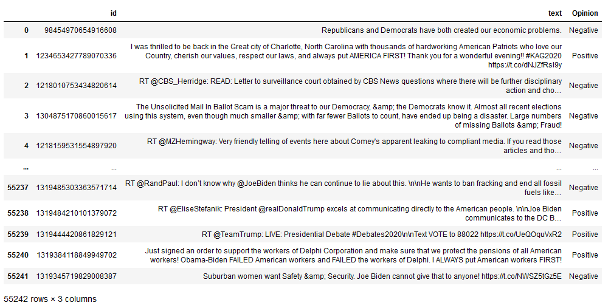
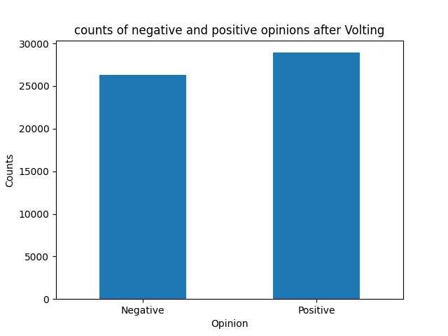

# Tâche 3 : Analyse d'opinions 
Dans cette section, nous avons entrainé et employé trois modèles neuronaux (CNN, LSTM, BERT) pour extraire les opinions des tweets. Nous avons évalué les performances de ces trois modèles en utilisant des jeux de tests distincts. Ensuite, nous avons combiné leurs prédictions à l'aide de la méthode de "Voting" pour obtenir un corpus final annoté avec les opinions correspondantes. 

Pour la partie d'implémentation des  modèles neuronaux nous avons utilisé deux API **Tensorflow** (CNN et LSTM) et **Pytorch** (Bert),On a entrainé les modèles avec un [corpus  de plus 1.5 millions tweets annoté](./train).   

# [LSTM](./Bi-LSTM/) et [CNN](./CNN) 

Avant de commencer ,nous avons  utilisé les 1,5 millions de tweets non étiquetés avec **Word2vec** pour pré-entraîner les embeddings de mots qui seront ensuite utilisés dans les réseaux de neurones CNN et LSTM. Pour cela nous avons utilisé la librerie <code>gensim</code>, avec le code suivant:

```python
  def get_average_word2vec(tokens_list, vector, generate_missing=False, k=300):
      if len(tokens_list)<1:
          return np.zeros(k)
      if generate_missing:
          vectorized = [vector[word] if word in vector else np.random.rand(k) for word in tokens_list]
      else:
          vectorized = [vector[word] if word in vector else np.zeros(k) for word in tokens_list]
      length = len(vectorized)
      summed = np.sum(vectorized, axis=0)
      averaged = np.divide(summed, length)
      return averaged

  def get_word2vec_embeddings(vectors, clean_comments, generate_missing=False, k=300):
      embeddings = clean_comments.apply(lambda x: get_average_word2vec(x, vectors, 
                                                                                  generate_missing=generate_missing, k=k))
      return list(embeddings)
```
```python
  word2vec = KeyedVectors.load_word2vec_format(str(find('models/word2vec_sample/pruned.word2vec.txt')), binary=False)
  training_embeddings = get_word2vec_embeddings(word2vec, X.apply(lambda x : x.split()), generate_missing=True, k=EMBEDDING_DIM)
```
```python
  train_embedding_weights = np.zeros((len(word_index)+1, EMBEDDING_DIM))
  for word,index in word_index.items():
      train_embedding_weights[index,:] = word2vec[word] if word in word2vec else np.random.rand(EMBEDDING_DIM)
  print(train_embedding_weights.shape)
```

En utilisant cette méthode de pré-entraînement, nous avons réussi à réduire le temps nécessaire pour entraîner les modèles tout en améliorant leurs performances.

Pour l'entraînement des modèles nous préparons les données textuelles en convertissant les textes(tweets) en séquences numériques  (padding), <code>keras</code> offre cette fonctionalité avec <code>tensorflow.keras.preprocessing.text</code> et <code>tensorflow.keras.preprocessing.sequence</code>
 
 ```python
  MAX_SEQUENCE_LENGTH = 300
  EMBEDDING_DIM = 300
 ```
 
 ```python
  vectorizer = TfidfVectorizer(lowercase=False, sublinear_tf=True, dtype=np.float32).fit_transform(dataframe_res["text_clean"] )
  terms = vectorizer.get_feature_names_out()
 ```
 
 ```python
  vocab_size = len(terms)
  oov_tok = ''
  embedding_dim = EMBEDDING_DIM
  max_length = MAX_SEQUENCE_LENGTH
  padding_type='post'
  trunc_type='post'
  tokenizer = Tokenizer(num_words = vocab_size, oov_token=oov_tok)
  tokenizer.fit_on_texts(dataframe_res["text_clean"])

  text_sequences = tokenizer.texts_to_sequences(dataframe_res["text_clean"])
  text_padded = pad_sequences(text_sequences, padding='post', maxlen=max_length)
 ```
  Nous avons utilisé une matrice d'embedding de dimension (300, 300) pour représenter le tweet.

- **LSTM**

Un LSTM (Long Short-Term Memory) est un type de réseau de neurones récurrents (RNN) qui est conçu pour gérer les problèmes de dépendance à long terme dans les données séquentielles. Contrairement aux RNN traditionnels, les LSTM sont capables de conserver et d'utiliser des informations sur une longue séquence d'entrée, ce qui les rend particulièrement adaptés aux tâches nécessitant une compréhension contextuelle à long terme. Ils utilisent des cellules mémoire pour stocker et réguler les informations passées. Ces cellules ont la capacité de mémoriser et d'oublier des informations en fonction des signaux d'entrée et des portes de contrôle spécifiques.

Dans notre situation, nous avons utilisé une variante de réseau de neurones récurrents (RNN) appelée LSTM bidirectionnelle. Cette architecture permet de prendre en compte l'information contextuelle à la fois avant et après chaque mot dans une séquence. Cela nous permet de capturer les relations et les dépendances entre les mots de manière plus complète et d'améliorer la compréhension du contexte dans notre modèle. Pour notre modèle, nous avons adopté l'architecture séquentielle de TensorFlow. Cette architecture se compose de deux LSTM bidirectionnels comportant quatre couches cachées. Entre ces couches, nous avons inclus une couche de normalisation par lot (Batch Normalization) afin d'améliorer la stabilité et les performances du modèle. En tant que fonction d'activation, nous avons utilisé la fonction SELU (Scaled Exponential Linear Unit), et nous avons appliqué une initialisation LeCun normale pour les poids du modèle.



Cette architecture est inspirée de l'article. [_U.B. Mahadevaswamy, P. Swathi_](https://www.sciencedirect.com/science/article/pii/S1877050922024930)

- **CNN**
Dans notre projet, nous avons adopté l'utilisation d'un CNN (Convolutional Neural Network), qui est une architecture de réseau de neurones profonds largement utilisée pour traiter des données structurées. Dans notre cas particulier, nous avons entraîné le modèle à effectuer des prédictions en utilisant la matrice d'embedding spécifique à un tweet. Pour la conception de notre architecture, nous nous sommes inspirés de l'article [Mathieu Cliche. 2017](https://arxiv.org/pdf/1704.06125v1.pdf). Cette référence nous a fourni des idées et des techniques pour construire notre propre modèle CNN adapté à notre objectif. Dans notre implémentation, nous avons opté pour une architecture CNN fonctionnelle. Pour chaque branche de l'architecture, nous avons ajouté une couche de convolution suivie d'un max pooling. Ensuite, nous avons fusionné ces branches pour former une sortie commune. Le modèle comprend également deux couches cachées. Pour chaque couche de convolution, nous avons utilisé cinq filtres de taille différente (2, 3, 4, 5, 6). Cette approche nous permet d'explorer différentes échelles de caractéristiques.



---
_note_: Les deux modèle utilise l'optimisateur **Adam**:
--
```python
model.compile(loss=tf.keras.losses.binary_crossentropy,\
                 optimizer=tf.keras.optimizers.Adam(),\
                 metrics=['accuracy'])

```

```python
hist = model.fit(train_cnn_data, Label_train, epochs=5, batch_size=64, validation_split=0.1, shuffle=True,\
                callbacks=[tf.keras.callbacks.ModelCheckpoint(f"{MODEL_PATH}", save_best_only=True),\
                tf.keras.callbacks.ReduceLROnPlateau(factor=tf.math.exp(-0.1), patience=3, min_lr=0.00001)])

```

# [Bert](./Transformer)
Pour notre projet, nous avons utilisé une autre architecture de modèle appelée transformeur, plus précisément BERT. Pour mettre en oeuvre ce modèle, nous avons utilisé **PyTorch** et la bibliothèque **HuggingFace Transformers**. Cette bibliothèque offre une implémentation des architectures basées sur les Transformers et fournit une interface  pour utiliser ces modèles pré-entraînés.
```python
  from transformers import DistilBertTokenizerFast, DistilBertForSequenceClassification, Trainer, TrainingArguments
```
```python
  tokenizer = DistilBertTokenizerFast.from_pretrained(TRANSFORMER)
  train_dataset = twitterDataset(tokenizer(X_train.tolist(), padding="max_length", truncation=True), y_train.tolist())
  test_dataset = twitterDataset(tokenizer(X_test.tolist(), padding="max_length", truncation=True), y_test.tolist())
```
Dans ce code, nous utilisons <code>DistilBertTokenizerFast</code> de la bibliothèque Transformers pour créer un tokenizer spécifique à l'architecture DistilBERT.
A partir de cette tokinization, pour chaque tweets on a deux array <code>input_ids</code> et <code>attention_mask</code>

Pour notre modèle, nous avons opté pour l'utilisation d'une variante de BERT appelée DistilBERT. [DistilBERT](https://huggingface.co/distilbert-base-uncased) de [l'article Victor SANH, Lysandre DEBUT, Julien CHAUMOND, Thomas WOLF](https://arxiv.org/pdf/1910.01108.pdf) qui est une version plus petite et plus rapide du modèle BERT classique.

```python
  TRANSFORMER = "distilbert-base-uncased"
  model_bert = DistilBertForSequenceClassification.from_pretrained(TRANSFORMER, num_labels=2)
```
Les paramètres d'entraînement :

```python
    train_args = TrainingArguments(
      output_dir= RESULT_PATH,
      num_train_epochs=2,
      per_device_eval_batch_size=64,
      per_device_train_batch_size=16,
      warmup_steps=500,
      weight_decay=0.001,
      logging_dir=LOGS_PATH,
      logging_steps=10,
      optim="adamw_torch"
      )
```
```python
  trainer = Trainer(
      model= model_bert,
      args=train_args,
      train_dataset=train_dataset
      )
```
---

Après avoir évalué les modèles les jeux de test, nous avons constaté que le modèle BERT offre de meilleures prédictions pour la classification des opinions.

| Modèle   | Précision |
|----------|-----------|
| LSTM-BI  | 0.796     |
| CNN      | 0.784     |
| BERT     | 0.840     |

---
_Resultat_:
---


---

# [Volting](./Analyse_opinion_comparaison_entre_model.ipynb)
Le "Voting" est une technique utilisée pour combiner les prédictions de plusieurs modèles individuels afin de prendre une décision finale. L'idée derrière le Voting est que les modèles individuels peuvent avoir des biais différents ou des erreurs aléatoires, mais en les combinant, on peut espérer obtenir une prédiction plus robuste et plus précise.

Dans notre cas, nous avons utilisé une variante appelée **soft voting** ou **voting pondéré**. Chaque modèle a été assigné à un poids correspondant à sa précision individuelle, qui a été normalisée en divisant par la somme des précisions de tous les modèles. Ainsi, les modèles les plus performants ont un poids plus élevé dans la décision finale, tandis que les modèles moins performants ont un poids plus faible. Cette approche permet de prendre en compte la performance de chaque modèle lors de la combinaison des prédictions, en attribuant plus d'importance aux modèles plus précis. Cela peut conduire à une prédiction finale plus fiable et plus précise, en exploitant la diversité et la complémentarité des modèles individuels.

```python
  def soft_volting(row):
    models_precisions = {"LSTM":0.796, "CNN":0.784 ,"DistilBERT":0.840}
    precision_values = list(models_presicions.values())
    row_average = np.average(row, weights=precision_values/np.sum(precision_values))
    return ("Positive" if row_average>=0.5 else "Negative")
```

```python
  tweets_opinion_binary =  tweets_opinion.replace(["Negative", "Positive"], [0, 1])
  opinion_volting = pd.DataFrame(dataframe_bert[["id","text"]].copy())
  opinion_volting["Opinion"] =tweets_opinion_binary.apply(lambda row: soft_volting(row), axis=1)
  opinion_volting
```
_Resultat_
---




