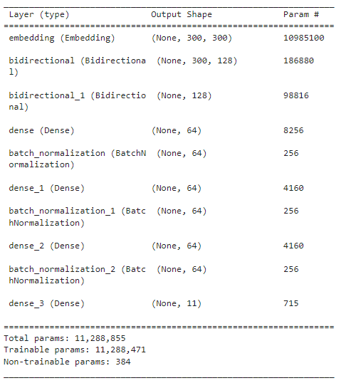
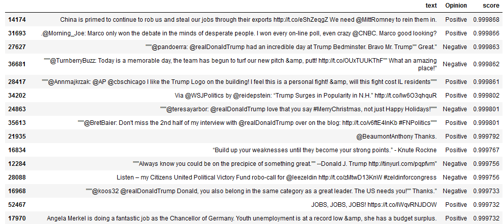

# Tâche 4 : Recherche d’informations dans le corpus

Dans cette section, nous utiliserons des méthodes de recherche dans le corpus. La première méthode consiste à utiliser un LSTM pour traduire une requête en un vecteur de thèmes. Les thèmes correspondent aux [thèmes](../Tache2_Analyse_thématique/content/tweets_anote.png) identifiés dans la [Tâche 2 d'Analyse thématique du corpus](../Tache2_Analyse_thématique). Ensuite, nous calculerons la similarité en utilisant le cosinus entre le vecteur de thèmes de la requête et les vecteurs de thèmes des tweets présents dans le corpus. La deuxième méthode consiste à utiliser un modèle BERT Pointwise. L'implémentation et l'entraînement de ce modèle se feront à l'aide de **PyTorch** et de la bibliothèque **HuggingFace Transformers**. Cette approche permettra d'effectuer une recherche plus précise et d'obtenir des résultats pertinents en termes de similarité entre la requête et les tweets du corpus.

# [LSTM](./model/LSTM)
L'architecture du modèle sera basée sur celle de la [Tâche 3 : Analyse d'opinions](../Tache3_Analyse_opinion/Bi-LSTM), avec quelques similitudes. Le modèle sera entraîné sur le corpus des tweets annotés de la [Tâche 2 d'Analyse thématique du corpus](../Tache2_Analyse_thématique/content/clean_tweet_topics.csv).



les paramêtre d'entrainement :
---

```python
bi_lstm_nn = Bi_lstm_nn().build(embedding_dim, max_length, len(word_index)+1, train_embedding_weights, labels.shape[1])
_ = bi_lstm_nn.compile(loss=tf.keras.losses.binary_crossentropy,\
                 optimizer=tf.keras.optimizers.Adam(),\
                 metrics=['accuracy'])
```
```python
history = bi_lstm_nn.fit(train_padded, y_train, epochs=100, validation_split=0.1, shuffle=True,\
                     callbacks=[tf.keras.callbacks.ModelCheckpoint(f"{MODEL_PATH}", save_best_only=True),\
                                tf.keras.callbacks.ReduceLROnPlateau(factor=tf.math.exp(-0.1), patience=80, min_lr=0.00001)])
```

[_Resultat_](./ranking_lstm.ipynb)
---

Le résultat de la recherche pour la requête **"Donald Trump's presidential campaign"** serait le suivant :


# [BERT](./model/Bert/Pointwise)
